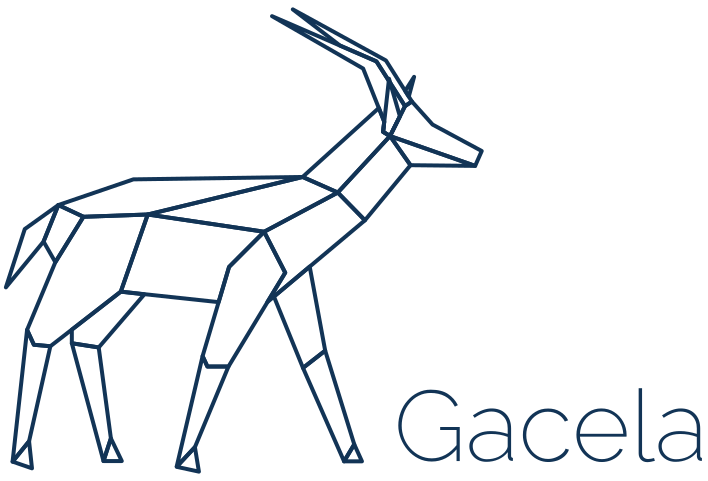

<p align="center">
    <picture>
      <source media="(prefers-color-scheme: dark)" srcset="gacela-logo-dark.svg">
      
    </picture>
</p>

<p align="center">
  <a href="https://github.com/gacela-project/gacela/actions/workflows/tests.yml">
    
  </a> <a href="https://packagist.org/packages/gacela-project/gacela">
    
  </a> <a href="https://shepherd.dev/github/gacela-project/gacela">
    
  </a> <a href="https://dashboard.stryker-mutator.io/reports/github.com/gacela-project/gacela/main">
    
  </a> <a href="https://github.com/gacela-project/gacela/blob/main/LICENSE">
    
  </a>
</p>

## Gacela — build modular PHP applications

Gacela normalizes module boundaries so parts of your application communicate through a single entry point, without leaking internals.

Each module is built from four pillars — only the first two are required:

- [**Facade**](https://gacela-project.com/docs/facade/) — public API, the only way in
- [**Factory**](https://gacela-project.com/docs/factory/) — creates internal services
- [**Provider**](https://gacela-project.com/docs/provider/) — wires external dependencies *(optional)*
- [**Config**](https://gacela-project.com/docs/config/) — reads project config *(optional)*

## Installation

```bash
composer require gacela-project/gacela
```

Requires PHP 8.3+. Coming from 1.x? See [UPGRADE.md](UPGRADE.md).

## Module structure

```
app/
├── gacela.php
├── config/
└── src/
    └── Blog/
        ├── BlogFacade.php
        ├── BlogFactory.php
        ├── BlogProvider.php
        └── BlogConfig.php
```

That is what `make:module App/Blog` below writes. Pass `--short-name` for `Facade.php` instead of `BlogFacade.php` — both resolve; the prefix is the default because it survives being read out of context.

## CLI

```bash
vendor/bin/gacela init                  # scaffold gacela.php
vendor/bin/gacela make:module App/Blog  # scaffold a module
vendor/bin/gacela                       # every command
```

Modules can be inspected, validated and prepared for production — see [CLI commands](docs/cli.md).

## Documentation

Start with [getting started](docs/getting-started.md), then [getting a dependency](docs/getting-a-dependency.md) — the one that answers "how do I reach *that* from *here*". [`docs/`](docs/README.md) is the full index; the rest:

- [Upgrading from 1.x](UPGRADE.md)
- [CLI commands](docs/cli.md)
- [Container configuration](docs/container-configuration.md) — bindings, contextual bindings, attributes, hooks
- [Caching](docs/caching.md) and [cacheable methods](docs/cacheable-methods.md)
- [Static analysis (PHPStan / Psalm)](docs/static-analysis.md)
- [Module health checks](docs/module-health-checks.md)
- [Events](docs/events.md)
- [Testing](docs/testing.md)
- [Opcache preload](docs/opcache-preload.md) and [production performance](docs/production-performance.md)
- Full reference: [gacela-project.com](https://gacela-project.com/)
- [Symfony bundle](bridges/symfony-bridge/README.md) — bootstrap Gacela from the kernel, reach Symfony services, `bin/console gacela:*`
- [Laravel provider](bridges/laravel-bridge/README.md) — bootstrap Gacela when the app boots, reach Laravel services, `artisan gacela:*`
- Examples:
  - [gacela-example](https://github.com/gacela-project/gacela-example)
  - [symfony-gacela-example](https://github.com/gacela-project/symfony-gacela-example) — Gacela with Symfony 7.4
  - [laravel-gacela-example](https://github.com/gacela-project/laravel-gacela-example) — Gacela with Laravel 12

## Contributing

Report [issues](https://github.com/gacela-project/gacela/issues), share [ideas](https://github.com/gacela-project/gacela/discussions), or open a [pull request](.github/CONTRIBUTING.md).

---

> Inspired by [Spryker](https://github.com/spryker).
